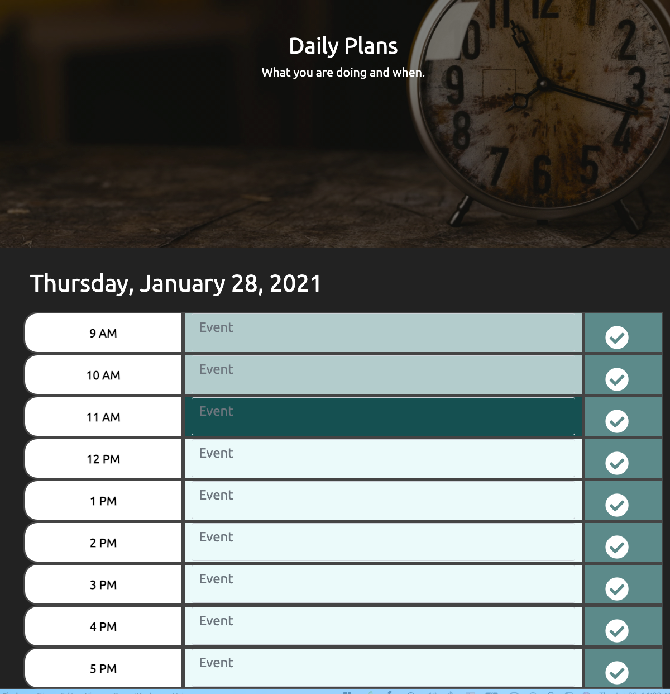

# Daily Planner

## Created to help keep track of the time
This planner was made for the busy work schedule! Using Luxon.js, this app highlights the current hour while demarking the past and future in a different color helping you stay on task.

Also to note, the date and weekday is prominently desplayed at the top of the application.

This application was designed based on a 9am - 5pm workday that occurs Monday - Friday.

## Workflow of the Application
1. Enter the event, appointment or other time sensitive happening into the appropriate time field.

2. Once the event has been typed out, click the check mark to the right of the text field to save the event.

3. As time progresses throughout your day, the present time field will highlight. 

### Screenshot of the Application

### Thank you so very much!
I am grateful for the opportunity to be able to utilize my skills to help create something that will further assist you in your capacites while making your work a bit easier.

Feel free to reach out with any questions, comments or concerns that you may have.

## Link to Application

http://aereisdin.github.io/daily-planner